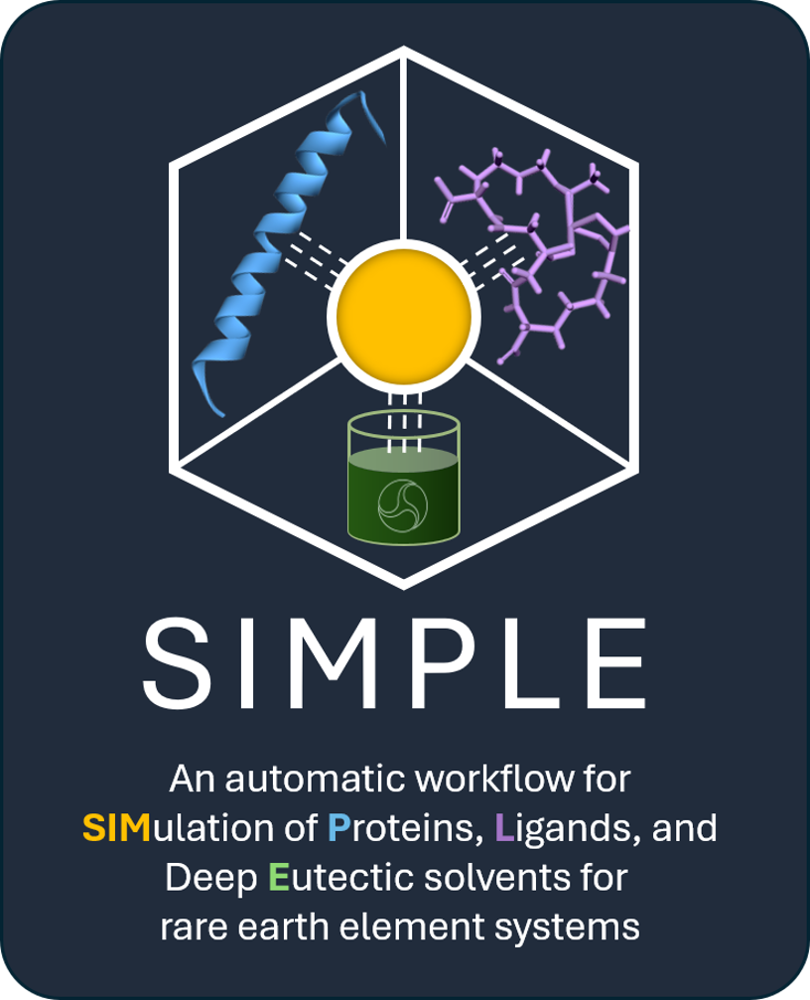
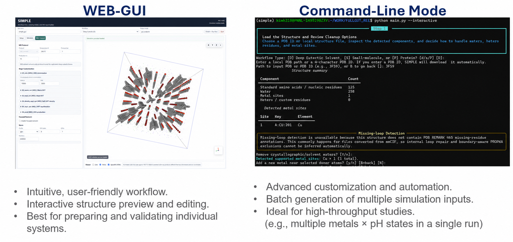
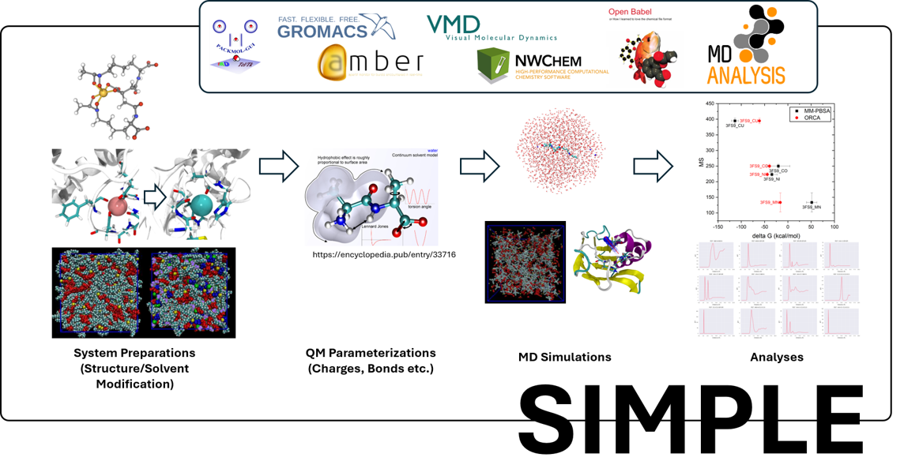

<p align="center">
  
</p>

# SIMPLE

### An automatic workflow for **SIM**ulation of **P**roteins, **L**igands, and deep **E**utectic solvents for rare earth element systems

SIMPLE is a Python platform for preparing, parameterizing, and analyzing molecular simulations involving rare earth elements (REEs). It connects structure preparation, quantum-mechanical parameterization, metal-site treatment, molecular dynamics (MD) system construction, simulation input generation, and downstream analysis in one reproducible workflow.

[Installation](#installation) · [Quick start](#quick-start) · [Tutorial](docs/tutorial.md)

> [!IMPORTANT]
> SIMPLE automates workflow setup, but it does not replace scientific review. Inspect generated structures, charges, parameters, metal-site assumptions, and simulation inputs before starting production calculations.

## Why SIMPLE?

REE simulations often require manual handoffs among structure editors, quantum-chemistry programs, parameterization utilities, MD engines, and analysis tools. These handoffs are time-consuming, difficult to reproduce, and especially error-prone when many metals, ligands, protonation states, solvents, or force-field choices must be evaluated.

SIMPLE provides:

- an integrated path from molecular structure to simulation-ready inputs;
- guided visual setup through a local browser GUI;
- an interactive command-line workflow for terminal and HPC use;
- reusable TOML configurations for repeatable and high-throughput campaigns;
- explicit handling of metal identity, oxidation state, coordination, solvent, and 12-6-4 parameter choices;
- consistent output layouts and manifests that preserve workflow decisions.

### Key developers

- Hoshin Kim (hoshin.kim@pnnl.gov) — Main Developer
- Daniel Mejia-Rogriguez (daniel.mejia@pnnl.gov)
- Edo Apra (Edoardo.Apra@pnnl.gov)
- Amity Andersen
- Mark Maupin (mark.maupin@pnnl.gov) — Principal Investigator

For questions about the code or implementation, contact Hoshin Kim at hoshin.kim@pnnl.gov.

## Interfaces

SIMPLE supports both visual, system-by-system preparation and automated campaign generation.

<p align="center">
  
</p>

| Interface | Recommended use | Launch |
| --- | --- | --- |
| Web GUI | Guided setup, structure inspection, visual editing, and individual systems | `simple-gui` |
| Interactive CLI | Detailed scientific control and terminal or HPC workflows | `simple wizard` |
| Configuration-driven CLI | Reproducible runs, parameter sweeps, and batch campaigns | `simple run --config config.toml` |
| Free-energy launcher | TI and MM-PBSA setup from an existing complex MD workflow | `simple-free-energy --interactive` |
| Analysis launcher | Free-energy summaries and trajectory analysis | `simple-analyze` |

The web GUI runs locally and opens in the default browser. It binds to `127.0.0.1` by default and is not exposed publicly.

## Workflow

<p align="center">
  
</p>

A typical SIMPLE workflow contains four connected stages:

1. **System preparation** — load and inspect a protein, metallophore, small molecule, or DES system; review structural changes; and define the chemical environment.
2. **Parameterization** — prepare ligand charges and force-field parameters, define metal treatment, and assemble the selected solvent and ion models.
3. **MD setup** — build the Amber system and generate staged simulation inputs and optional Slurm scripts.
4. **Analysis** — prepare free-energy calculations or analyze completed trajectories and saved results.

Configurations and manifests connect these stages so that a reviewed setup can be reproduced or expanded into a larger campaign.

## Supported system types

### Metallophores and small molecules

Load common molecular structure formats, inspect or edit the metal coordination environment, generate ligand parameters, and prepare solvated MD systems.

### Metalloproteins

Load a local PDB file or retrieve a structure by PDB ID, inspect protein and hetero components, review metal sites and protonation, handle retained ligands, and prepare complete simulation inputs.

For directly coordinating HIS, CYS, ASP, GLU, or MET residues, SIMPLE also offers an optional expert protein-site RESP workflow through `main.py`. Standard force-field charges remain the default. The advanced interactive workflow prepares a fixed-geometry r2SCAN/def2-TZVP NWChem calculation, pauses while the external CPU job runs, then discovers and validates the result on a later run. The metal remains at its integer formal charge, each target residue retains its original total charge, and only the reviewed residue partial-charge redistribution is applied after the 12-6-4 C4 terms have been generated.

The web GUI does not create new protein-site RESP calculations. It retains **Scan / Browse RESP Results** so a completed `main.py` case folder can be imported recursively, fingerprint-checked, reviewed, and applied to a compatible rebuilt topology.

This is a hybrid model outside the original 12-6-4 parameter combination and should be treated as a scientific modeling choice, not an automatic improvement. SIMPLE records that status in the generated manifest, preserves `system.standard_ff.prmtop`, and requires charge review before replacing the canonical `system.prmtop`. See the [12-6-4 model paper](https://pmc.ncbi.nlm.nih.gov/articles/PMC4306492/) and [MCPB.py paper](https://pubs.acs.org/doi/10.1021/acs.jcim.5b00674) for scientific context.

### Deep eutectic solvents

Build DES compositions from reusable components, define mixture ratios and placement, add metal sites when needed, and generate DES-specific equilibration and production protocols.

### Component library

Inspect and register compatible Amber library and parameter-file pairs for reuse in DES workflows.

## Main capabilities

- Protein, ligand, metallophore, and DES structure preparation
- Metal deletion, replacement, and insertion
- PROPKA-assisted protonation review and optional missing-loop handling
- GAFF/GAFF2 ligand parameterization and manual Amber parameter bundles
- RESP and NWChem input preparation
- Optional advanced `main.py` constrained protein metal-site RESP redistribution with pause/resume validation and GUI result import
- Amber/tleap system construction
- Configurable force fields, water models, box shapes, salt conditions, and metal models
- OPC + Duvail and SPC/E + Li/Merz 12-6-4 parameter pathways
- Staged MD protocols and CPU/GPU Slurm script generation
- TOML-based reproducible and high-throughput execution
- TI and MM-PBSA setup
- RMSD, RMSF, radius-of-gyration, RDF, and distance analyses

## Installation

SIMPLE requires Python 3.11. The molecular-simulation programs needed at runtime depend on the selected workflow.

### Get SIMPLE

Clone the SIMPLE repository and move into the downloaded project directory before creating the Python environment:

```bash
git clone https://github.com/EMSL-Computing/SIMPLE.git
cd SIMPLE
```

### Recommended installation

For a normal installation on Linux, WSL, or a Linux HPC login node, use the SIMPLE installer:

```bash
python install_simple.py
conda activate simple
```

> [!IMPORTANT]
> `python install_simple.py` is the default installation method. It creates or updates the Conda environment, asks which optional scientific packages to install or reuse, and writes the per-user `tools.toml`. Do not begin with `conda env create -f environment.yml` unless you intentionally want the manual base-only installation described below.

The installer creates the Python 3.11 base environment and asks how each optional scientific tool should be provided:

- **AmberTools 26:** install with Conda (recommended), use an existing installation, or disable it;
- **licensed AMBER:** register an existing `AMBERHOME` or environment module, or leave it disabled; and
- **NWChem:** install NWChem and OpenMPI together with Conda, register an existing matched NWChem/MPI installation, or disable it.

AmberTools 26 is recommended because it supplies the Amber preparation and analysis programs used by SIMPLE, including the data and utilities required by the supported 12-6-4 setup paths. With AmberTools alone, users can run system preparation and construction, parameter preparation, input generation, most analyses, the CLI, and the GUI. What AmberTools alone cannot do is execute SIMPLE production MD or TI/free-energy simulations that require licensed `pmemd`, `pmemd.MPI`, or `pmemd.cuda`. Those simulation inputs can still be inspected and prepared after the required setup data are available.

The installer uses the Packmol executable bundled with AmberTools 26. Do not add the separate `packmol` Conda package to that environment, because the additional constraint can make the solver select an obsolete AmberTools build.

> [!WARNING]
> **AmberTools is not the licensed AMBER package. SIMPLE never downloads or installs licensed AMBER.** Generic production MD and TI/free-energy simulation scripts will refuse to run until the user separately obtains a valid AMBER license, installs AMBER at the execution site, and records its `AMBERHOME` or module in SIMPLE's `tools.toml`. Never copy, publish, bundle, or redistribute licensed AMBER executables with SIMPLE or a Conda environment.
>
> Under the current Amber26 policy, academic, nonprofit, and government non-commercial use has a $0 license fee, but accepting and registering the separate Amber26 license is still required. Commercial use requires a paid license. Check the [official Amber download and licensing page](https://ambermd.org/GetAmber.php) for the current terms before installing or running `pmemd*`.

The conda-forge AmberTools 26 build is the non-MPI/non-CUDA build. Installing OpenMPI for NWChem does not add `pmemd*` executables to AmberTools.

> [!IMPORTANT]
> **Tahoma users:** install AmberTools 26 in the SIMPLE Conda environment for preparation, GUI use, and analysis. The generic scripts use `tools.toml`, but the Tahoma-specific MD, TI, RESP, and MM-PBSA `sbatch` files retain their existing site-specific setup. No local licensed-AMBER path needs to be added merely to generate or use those Tahoma scripts.

For NWChem, keep the executable and MPI launcher from one compatible installation. Do not combine a Conda NWChem executable with a system/vendor `mpirun`, or an external NWChem executable with Conda OpenMPI. Keep the Conda environment activated when using the Conda NWChem option so its activation data, including the basis-library configuration, remain available.

For an unattended installation, make every choice explicitly:

```bash
python install_simple.py --yes --ambertools conda --amber disabled --nwchem disabled
```

Use `--amber external --amber-home /path/to/amber26` for an existing licensed AMBER installation, or `--nwchem external --nwchem-binary /path/to/nwchem --mpi-launcher /matching/path/to/mpirun` for an existing NWChem/MPI stack.

#### Manual base-only Conda installation

The plain environment file contains the base environment only. This advanced route is available when environment creation and scientific packages must be managed manually:

```bash
conda env create -f environment.yml
conda activate simple
simple configure
```

If this route is used, install any selected Conda AmberTools or NWChem packages separately; changing a TOML mode to `conda` does not install the package.

### External software configuration

The installer writes a per-user configuration, normally at `~/.config/simple/tools.toml` on Linux. Display its effective location and detected executables with:

```bash
simple doctor
```

Reconfigure it interactively with:

```bash
simple configure
```

An external installation can be recorded directly in the generated TOML:

```toml
[software.ambertools]
mode = "conda"
home = "/path/to/conda/envs/simple"

[software.amber]
mode = "external"
home = "/path/to/amber26"
activation = "amber_sh"
setup_script = "/path/to/amber26/amber.sh"
module_name = ""

[software.nwchem]
mode = "external"
binary = "/path/to/nwchem"
mpi_launcher = "/matching/path/to/mpirun"
module_name = ""
```

Other reviewed executable overrides, such as `packmol`, `openbabel`, `pdbfixer`, or `apptainer`, may be placed under `[software.executables]`. SIMPLE uses configured paths before general `PATH` discovery.

When a **generic** MD, TI, or RESP `sbatch` is generated, SIMPLE resolves the selected software settings and embeds the AMBER or NWChem/MPI paths and runtime checks in that script. Later edits to `tools.toml` do not silently alter a job that has already been generated. Regenerate the generic script to apply a changed path. Tahoma-specific scripts deliberately do not consume these user paths and are generated as before.

### Pip-only installation

To install only the SIMPLE Python package into an existing Python 3.11 environment:

```bash
python -m pip install .
simple configure
```

Pip does not install AmberTools, Amber, NWChem, Packmol, Open Babel, or other non-Python scientific programs. Supply the tools required by the selected workflow separately, then check which executables SIMPLE can see:

```bash
simple doctor
```

AmberTools, NWChem, and full Amber execution are intended for Linux, WSL, or HPC systems. Native Windows can be used for the GUI, configuration, structure inspection, file generation, and dry runs.

## Quick start

### Web GUI

After installation:

```bash
simple-gui
```

To select a port or start without opening a browser:

```bash
simple-gui --web-port 8000
simple-gui --no-browser
```

When working directly from the repository, `python GUI.py` provides the same launcher.

### Interactive command line

Start the guided terminal workflow:

```bash
simple wizard
```

Save the selected options as a reusable configuration:

```bash
simple wizard --write-config config.toml
```

### Configuration-driven run

Run a saved configuration:

```bash
simple run --config config.toml
```

Generate and validate files without executing Amber binaries:

```bash
simple run --config config.toml --dry-run
```

The standalone launcher remains available when working directly from the repository:

```bash
python main.py --interactive
python main.py --config config.toml --dry-run
```

For a fuller guided walkthrough, see the [SIMPLE Tutorial](docs/tutorial.md).

## Output organization

The main simulation workflow uses a staged directory layout:

```text
output_directory/
├── 01_prepare/   # prepared structures, manifests, and parameterization assets
├── 02_system/    # system-building inputs, topology, and coordinates
└── 03_md/        # MD input files and scheduler scripts
```

Saved TOML configurations and stage manifests make the setup inspectable and allow selected stages to be regenerated without repeating the entire workflow.

## Free energy and analysis

Prepare a free-energy workflow from an existing MD setup:

```bash
simple-free-energy --interactive
```

Open the analysis launcher:

```bash
simple-analyze
```

Open trajectory analysis directly:

```bash
simple-analyze --trajectory
```

These launchers cover TI and MM-PBSA preparation, saved-result summaries, and common trajectory analyses. Detailed procedures will be documented in the tutorial.

Reusable TI analysis-library results are stored in the operating system's per-user application-data directory, not in the source checkout. Set `SIMPLE_ANALYSIS_LIBRARY_DIR` to use a reviewed shared or campaign-specific location.

## Documentation

- [Tutorial](docs/tutorial.md) — guided usage documentation
- [Manual ligand parameters](docs/manual_ligands.md) — accepted Amber-ready parameter bundles

## Support

For workflow questions or error reports, contact `hoshin.kim@pnnl.gov`.

## Disclaimer

This material was prepared as an account of work sponsored by an agency of the
United States Government. Neither the United States Government nor the United
States Department of Energy, nor Battelle, nor any of their employees, nor any
jurisdiction or organization that has cooperated in the development of these
materials, makes any warranty, express or implied, or assumes any legal
liability or responsibility for the accuracy, completeness, or usefulness or
any information, apparatus, product, software, or process disclosed, or
represents that its use would not infringe privately owned rights.

Reference herein to any specific commercial product, process, or service by
trade name, trademark, manufacturer, or otherwise does not necessarily
constitute or imply its endorsement, recommendation, or favoring by the United
States Government or any agency thereof, or Battelle Memorial Institute. The
views and opinions of authors expressed herein do not necessarily state or
reflect those of the United States Government or any agency thereof.

<p align="center">
  <strong>PACIFIC NORTHWEST NATIONAL LABORATORY</strong><br>
  operated by<br>
  <strong>BATTELLE</strong><br>
  for the<br>
  <strong>UNITED STATES DEPARTMENT OF ENERGY</strong><br>
  under Contract DE-AC05-76RL01830
</p>

## License

Copyright Battelle Memorial Institute 2026

Redistribution and use in source and binary forms, with or without
modification, are permitted provided that the following conditions are met:

1. Redistributions of source code must retain the above copyright notice, this
   list of conditions and the following disclaimer.

2. Redistributions in binary form must reproduce the above copyright notice,
   this list of conditions and the following disclaimer in the documentation
   and/or other materials provided with the distribution.

THIS SOFTWARE IS PROVIDED BY THE COPYRIGHT HOLDERS AND CONTRIBUTORS "AS IS" AND
ANY EXPRESS OR IMPLIED WARRANTIES, INCLUDING, BUT NOT LIMITED TO, THE IMPLIED
WARRANTIES OF MERCHANTABILITY AND FITNESS FOR A PARTICULAR PURPOSE ARE
DISCLAIMED. IN NO EVENT SHALL THE COPYRIGHT HOLDER OR CONTRIBUTORS BE LIABLE
FOR ANY DIRECT, INDIRECT, INCIDENTAL, SPECIAL, EXEMPLARY, OR CONSEQUENTIAL
DAMAGES (INCLUDING, BUT NOT LIMITED TO, PROCUREMENT OF SUBSTITUTE GOODS OR
SERVICES; LOSS OF USE, DATA, OR PROFITS; OR BUSINESS INTERRUPTION) HOWEVER
CAUSED AND ON ANY THEORY OF LIABILITY, WHETHER IN CONTRACT, STRICT LIABILITY,
OR TORT (INCLUDING NEGLIGENCE OR OTHERWISE) ARISING IN ANY WAY OUT OF THE USE
OF THIS SOFTWARE, EVEN IF ADVISED OF THE POSSIBILITY OF SUCH DAMAGE.
