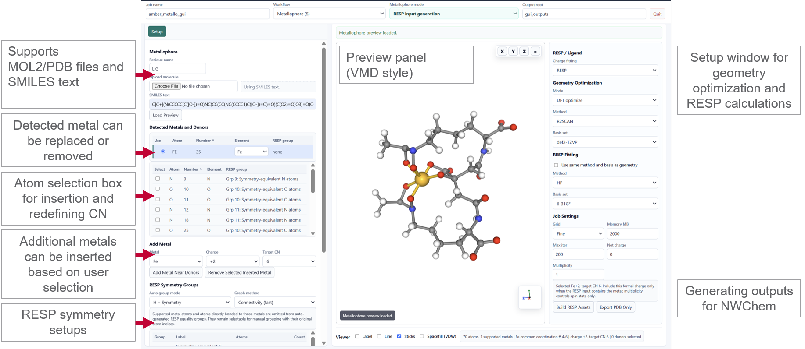
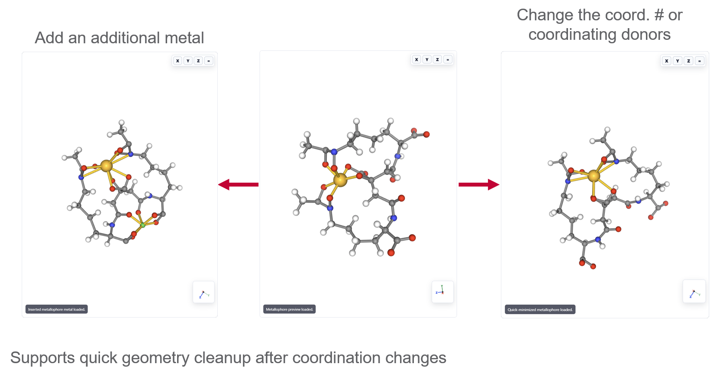
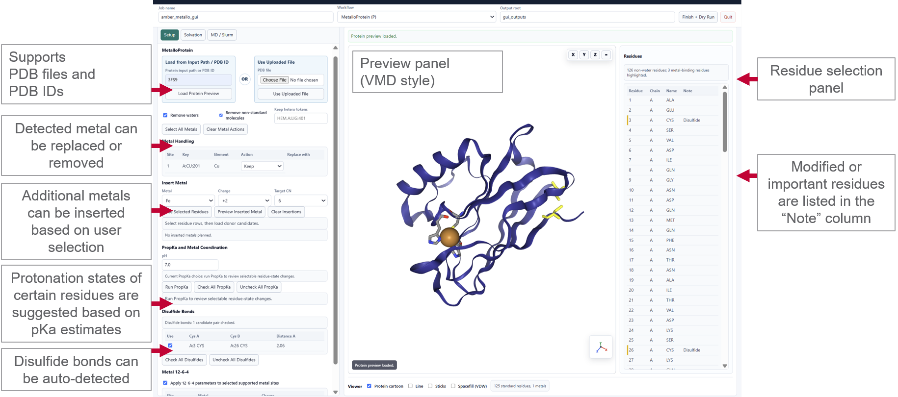
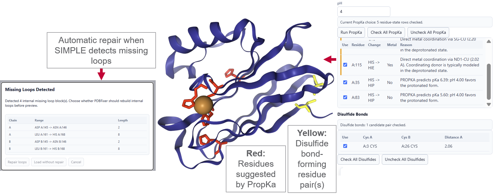
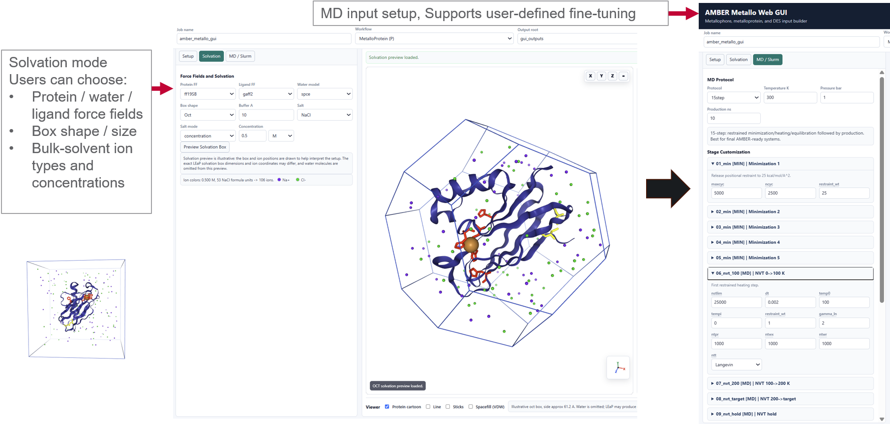
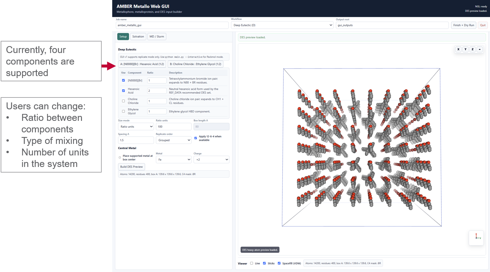
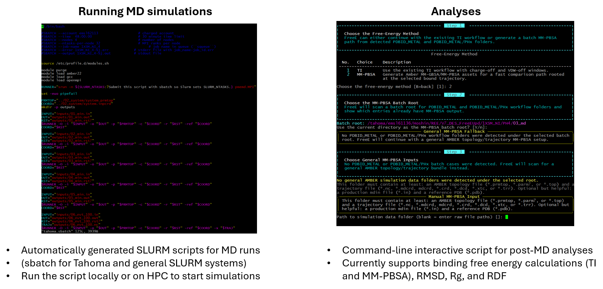
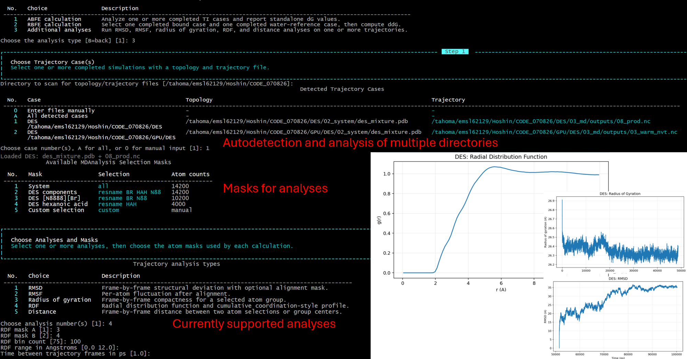

# SIMPLE Tutorial

This tutorial describes the main ways to use SIMPLE for metal-containing simulation setup and analysis. SIMPLE can be used through the browser GUI for visual, system-by-system preparation, or through the command line for reproducible and batch workflows.

## 1. Launching the Web GUI

Start the browser interface from the repository root:

```bash
python GUI.py --web
```

On a local workstation, this command starts the GUI server and opens the default web browser automatically. If the browser does not open, copy the printed local URL into a browser manually.

When running on an HPC login node or other remote machine, disable automatic browser launch and choose a forwarded port:

```bash
python GUI.py --web --web-port 8000 --no-browser
```

Then open the forwarded address in your local browser. A typical SSH tunnel is:

```bash
ssh -L 8000:127.0.0.1:8000 USER@HPC_HOST
```

The GUI runs on `127.0.0.1` and is intended for private local or forwarded access. Uploaded files are first staged in the GUI session directory, then copied into the workflow output folder when a TOML file is saved or when `Finish + Build Inputs` is pressed.

The final workflow folder is organized as:

```text
output_root/job_name/
  00_inputs/    # GUI-staged uploaded files
  01_prepare/   # cleaned structures, manifests, ligand/RESP assets
  02_system/    # tleap, ParmEd, prmtop, inpcrd, and system PDB files
  03_md/        # MD input files and Slurm scripts
```

## 2. Metallophore GUI Workflow

Use the **Metallophore (S)** workflow for small metal-binding molecules, metallophores, and ligand-like systems.



The metallophore workflow supports MOL2 and PDB files, as well as SMILES text. After loading the molecule, SIMPLE detects supported metal atoms and donor atoms. You can keep, replace, or remove detected metals; select donor atoms; insert an additional metal near selected donors; and prepare RESP/NWChem input assets when RESP charges are needed.

The central preview panel uses a VMD-style molecular view so the coordination environment can be inspected before generating files. The right-side setup panel controls geometry optimization, RESP fitting settings, charge, multiplicity, grid choice, and job-size settings.



After editing coordination, SIMPLE can perform a quick geometry cleanup. This is useful after changing donor atoms, changing the target coordination number, or inserting another metal. The cleanup is not a replacement for scientific review, but it helps remove obviously strained preview geometries before parameterization.

Typical steps:

1. Choose **Metallophore (S)**.
2. Upload a structure file or enter a SMILES string.
3. Load the preview and inspect detected metal/donor atoms.
4. Adjust metal identity, oxidation state, donor selection, or coordination number.
5. Choose the charge method, geometry optimization settings, and RESP settings if needed.
6. Use **Build RESP Assets** for RESP workflows, or use **Finish + Build Inputs** when the system is ready for Amber input generation.

## 3. Metalloprotein GUI Workflow

Use **MetalloProtein (P)** for protein systems containing native or inserted metal sites.



The protein workflow accepts a local PDB file or a PDB ID. It can remove waters, remove non-standard hetero groups, retain selected ligand tokens, identify metal sites, and prepare a cleaned structure for Amber. The residue table highlights important residues, such as metal-binding residues and candidate disulfide residues, in the **Note** column.

Metal handling options include:

- keep the detected metal;
- remove selected metals;
- replace a detected metal with another supported metal;
- insert an additional supported metal near selected residue donors.

PROPKA-assisted protonation review can suggest residue-state changes based on pKa estimates. Disulfide candidates can also be detected and selected before system building.

### Optional protein metal-site RESP charges

New protein metal-site RESP calculations are an advanced `main.py` option; the web GUI does not generate them. Keep standard ff19SB charges for the default 12-6-4 model, and choose the site-specific RESP path in the interactive `main.py` workflow only when a reviewed, site-polarization-aware hybrid model is scientifically justified.

SIMPLE then uses an unsolvated TLeap reference topology to establish hydrogens, protonation variants, atom indices, and baseline Amber charges. It detects directly coordinating HIS/CYS/ASP/GLU/MET residues and treats directly coordinating water or parameterized heteroligands as fixed QM environment. The default fit scope is the side chain; the metal formal charge, backbone, caps, fixed environment, target-residue total charges, and whole cluster charge remain constrained.

During the `main.py` prompts, SIMPLE shows the existing default/high-spin multiplicity and, where conventional ligand-field alternatives exist, a low-spin multiplicity as well. The default remains the original heuristic; the user must select and confirm the electronic state appropriate to the coordination environment. SIMPLE writes one NWChem/RESP job per independent metal cluster, or one joint job when multiple metals share a donor, together with generic and Tahoma CPU sbatch scripts. Each sbatch file starts directly with `#!/bin/bash`, followed by its `#SBATCH` directives. Submit the Tahoma script, or edit and submit the generic script; the MD workflow pauses at this point.

After the NWChem job completes, either continue through `main.py` or open the GUI and press **Scan / Browse RESP Results**. Choose the completed case folder rather than individual files; SIMPLE preserves the selected folder tree and searches all subdirectories for the required manifests and outputs. Select a completed candidate, then press **Finish + Build Inputs** to run the exact fingerprint check and display baseline, fitted, and delta charges together with residue sums, symmetry checks, fit metrics, and warnings. MD generation resumes only after **Approve Charges and Resume MD** is pressed. The standard-charge topology is retained as `02_system/system.standard_ff.prmtop`, while the validated patched topology becomes `02_system/system.prmtop`.



If SIMPLE detects missing internal loops, the GUI asks whether to repair the missing regions before preview. After the protein is loaded, residues suggested by PropKa are highlighted in red, and possible disulfide-bond-forming residue pairs are highlighted in yellow.

After setup, switch to the **Solvation** and **MD / Slurm** tabs.



The solvation tab controls:

- protein, ligand, and water force fields;
- water model and compatible 12-6-4 parameter set;
- box shape and buffer size;
- salt pair, neutralization mode, and bulk concentration;
- preview of the approximate solvent box and ion placement.

For Protein and Small Molecule metal setups, the GUI checks the selected element and oxidation state against the bundled Duvail tables. If a species such as a divalent transition-metal ion is absent, **OPC + Duvail** is disabled, an explicit warning is shown, and the setup switches to **SPC/E + Li/Merz** with SPC/E as the solvation default.

The MD / Slurm tab controls the MD protocol, temperature, pressure, production length, stage-level MD input overrides, and CPU/GPU Slurm script generation. Press **Finish + Build Inputs** to write the final TOML, run the workflow, and produce `system.prmtop`, `system.inpcrd`, MD inputs, and scheduler scripts.

## 4. Deep Eutectic Solvent GUI Workflow

Use **Deep Eutectic (D)** to build DES boxes from registered Amber component libraries.



The DES panel lets you select supported components, choose component ratios, set the mixing mode, and define the number of units or box size. SIMPLE can also place supported metal ions in the DES box center when requested. After preview, the same solvation and MD setup concepts apply, with DES-specific protocol defaults.

## 5. Running MD Before Free-Energy Work

SIMPLE writes Slurm scripts together with the generated MD input files. These scripts can be submitted directly on HPC systems after checking the account, partition, walltime, node count, GPU count, and module-loading section.



For a normal GUI or CLI simulation setup, inspect:

- `02_system/system.prmtop`
- `02_system/system.inpcrd`
- `02_system/system.pdb`
- `03_md/inputs/*.in`
- `03_md/*.sbatch`
- `workflow_manifest.json`

Then submit the generated Slurm script from the `03_md` directory or adjust it for the target machine. Free-energy setup usually starts after the production trajectory, restart, topology, and reference PDB are available, because `FreeE.py` builds new free-energy inputs from an existing bound MD workflow rather than replacing the original `main.py` setup.

## 6. Free-Energy Setup with FreeE.py

`FreeE.py` is the standalone launcher for setting up free-energy calculations from a completed or partially completed SIMPLE/Amber simulation. It keeps the original MD workflow untouched and writes a separate output directory containing free-energy input files, Slurm scripts, manifests, and, for MM-PBSA/GBSA, summary files.

Start the interactive free-energy wizard with:

```bash
python FreeE.py --interactive
```

Save the prompted answers to a reusable TOML file:

```bash
python FreeE.py --interactive --write-config free_energy_config.toml
```

Run a saved free-energy setup non-interactively:

```bash
python FreeE.py --config free_energy_config.toml
```

Use `--dry-run` when you want to generate and inspect the free-energy assets without validating or launching the external Amber executables:

```bash
python FreeE.py --config free_energy_config.toml --dry-run
```

### FreeE Input Selection

The wizard first looks for an existing AMBER topology, trajectory, production input file, production restart, and reference structure. In a typical SIMPLE output folder, these come from `02_system` and `03_md`. If automatic discovery is not enough, the wizard can also accept manual paths for:

1. **Topology**: the bound-system `system.prmtop`.
2. **Trajectory**: a production trajectory such as `*.nc`, `*.mdcrd`, or another Amber-readable trajectory.
3. **Reference structure**: the prepared `system.pdb` or another aligned reference PDB.
4. **Production mdin**: optional, but useful for estimating saved frames and locating the production stage.
5. **Production restart**: optional for some setup paths, but useful for snapshot-based preparation.

After loading the input, `FreeE.py` detects metal sites, proposes the selected metal atom or atoms, checks whether the last snapshot appears stable, and asks whether to continue if the selected site looks unstable.

### Thermodynamic Integration

Thermodynamic integration, or TI, computes a free-energy difference by gradually changing the Hamiltonian of the system along an alchemical coordinate called `lambda`. At each lambda window, Amber samples the ensemble average of `dV/dlambda`. The final free energy is obtained by numerical integration of those `dV/dlambda` values across the lambda schedule.

For metal binding workflows, SIMPLE treats the selected metal site as the alchemical group. The currently supported Amber 12-6-4 GTI/CUDA default changes charge and van der Waals interactions together along one softcore path. The split protocol is retained for the Amber 12-6 workaround and for future GTI support; it separates the transformation into two physical legs:

1. **Charge-off leg**: the metal charge is gradually removed. This avoids turning off electrostatics and van der Waals interactions at the same time, which can make endpoint sampling unstable.
2. **VDW-off leg**: after the decharged endpoint is relaxed, the nonbonded van der Waals interaction is removed with softcore TI settings.

For a binding free-energy style calculation, the bound leg should be paired with a metal-in-water reference leg. The analysis step later reports quantities such as `dG_bound`, `dG_water`, restraint correction, and `ddG = (dG_bound + restraint_correction) - dG_water` when both legs are available.

Important TI options in the FreeE TOML are:

- `free_energy.method = "ti"` selects the TI workflow.
- `snapshot.mode = "last"` uses the final production frame, while `snapshot.mode = "cluster"` chooses a representative binding-site snapshot from clustering.
- `snapshot.allow_unstable_last_snapshot` lets the workflow continue when the selected metal site looks unstable.
- `metal.selection_mode` can be `single`, `one_by_one`, or `all_at_once` for one metal, per-site batches, or simultaneous multi-metal setup.
- `metal.selected_site`, `metal.selected_sites`, `metal.formal_charge`, and `metal.formal_charges_by_site` control which detected metal sites are alchemically transformed and what formal charge is used.
- `ti.implementation_mode = "amber_12_6_workaround"` rebuilds TI-specific metal/ion nonbonded terms to the official Amber 12-6 set before charge-off and VDW-off TI.
- `ti.implementation_mode = "amber_12_6_4_gti"` keeps 12-6-4 C4 terms and generates CUDA/GTI-style Amber inputs. This path requires a GPU-capable Amber build.
- `ti.decoupling_mode = "combined_q_vdw"` is the current Amber 12-6-4 GTI/CUDA default and couples charge and VDW changes in a single softcore route.
- `ti.decoupling_mode = "split_q_vdw"` runs charge-off, endpoint relaxation, and VDW-off directories separately. The GTI variant is temporarily unavailable while its split-path implementation is being completed.
- `ti.sampling_mode = "single_pass"` is the default and recommended baseline. It runs one conventional forward lambda sweep.
- `ti.sampling_mode = "bidirectional"` is an optional convergence diagnostic. It equilibrates each window, runs one forward decoupling sweep, verifies its endpoint restart, and then runs one reverse recoupling sweep. Averaging the directions is useful only when their hysteresis is acceptably small; a large difference instead indicates insufficient equilibration, slow relaxation, or path dependence. It does not create automatic replicas, so rerun the workflow when independent repeats are needed.
- `ti.window_equilibration_ns` controls the excluded equilibration before each production window in bidirectional mode.
- `ti.production_time_ns` controls production length per lambda window.
- `ti.charge_lambdas` and `ti.vdw_lambdas` define the lambda schedules. They must be sorted, unique, and run from `0.0` to `1.0`.
- `ti.qoff_dt_ps` and `ti.vdwoff_dt_ps` control the timestep for charge-off and VDW-off windows.
- `ti.bound_start_min_cycles`, `ti.bound_start_eq_ns`, and `ti.bound_start_eq_dt_ps` control bound-start minimization and equilibration before TI.
- `ti.qoff_endpoint_min_cycles` and `ti.qoff_endpoint_eq_ns` control the short relaxation between the charge-off and VDW-off legs.
- `ti.restraint_force_constant`, `ti.restraint_half_width_angstrom`, and `ti.restraint_anchor_count` define the bound-site restraint used to keep the metal near coordinating donor atoms during the alchemical transformation.
- `ti.scalpha`, `ti.scbeta`, and `ti.logdvdl` control Amber softcore and DV/DL output behavior.
- `water_reference.enabled` controls whether a metal-in-water reference leg is generated.
- `water_reference.water_model`, `water_reference.box_shape`, `water_reference.buffer_angstrom`, and `water_reference.custom_ion_frcmods` control the reference-solvent system.
- `water_reference.reuse_existing`, `water_reference.reuse_from_library`, and `water_reference.library_key` allow reuse of an existing compatible water-reference setup.
- `slurm.profile`, `slurm.ntasks`, `slurm.gpus`, `slurm.walltime`, `slurm.partition`, and `slurm.account` control the generated execution scripts.

Combined mode uses a flat layout: inputs are written under `bound/inputs`, a single-pass run writes directly under `output`, and bidirectional results are separated into `output/forward` and `output/reverse`. The `qoff` and `vdwoff` directories are reserved for split mode.

A minimal TI TOML section looks like:

```toml
[free_energy]
method = "ti"

[snapshot]
mode = "last"

[metal]
selection_mode = "single"
selected_site = 1
formal_charge = 3

[ti]
implementation_mode = "amber_12_6_4_gti"
decoupling_mode = "combined_q_vdw"
sampling_mode = "single_pass"
production_time_ns = 1.0
charge_lambdas = [0.0, 0.1, 0.2, 0.3, 0.4, 0.5, 0.6, 0.7, 0.8, 0.85, 0.9, 0.95, 0.98, 1.0]
vdw_lambdas = [0.0, 0.025, 0.05, 0.1, 0.2, 0.3, 0.4, 0.5, 0.6, 0.7, 0.8, 0.9, 0.95, 0.975, 1.0]

[water_reference]
enabled = true
water_model = "opc"
reuse_existing = true
```

### MM-PBSA and MM-GBSA

MM-PBSA/GBSA estimates binding energetics from snapshots of a bound trajectory instead of running alchemical lambda windows. For each selected frame, the method evaluates an approximate free energy for the complex, receptor, and ligand, then reports a difference:

```text
DeltaG_binding = G_complex - G_receptor - G_ligand
G = E_MM + G_solvation - T*S
```

`E_MM` is the molecular-mechanics energy from the force field. `G_solvation` is estimated with an implicit-solvent model. GBSA uses a generalized Born model and is usually faster. PBSA solves a Poisson-Boltzmann style continuum electrostatics problem and is usually more expensive, but can be useful as a complementary estimate. The entropy term is optional because it can be noisy and expensive, especially for large metalloprotein systems.

For SIMPLE metalloprotein cases, the default MM-PBSA path treats the selected metal atom as the ligand and builds dry complex, receptor, and ligand topologies for Amber `MMPBSA.py`. For general Amber inputs, the wizard can ask for ligand residue names and optional receptor residue names instead.

Important MM-PBSA/GBSA options are:

- `free_energy.method = "mmpbsa"` selects the MM-PBSA/GBSA workflow.
- `mmpbsa.run_gb` enables MM-GBSA.
- `mmpbsa.run_pb` enables MM-PBSA.
- `mmpbsa.start_frame`, `mmpbsa.end_frame`, and `mmpbsa.frame_stride` control which saved trajectory frames are analyzed.
- The interactive wizard can choose the whole trajectory or the last 10 percent of available frames, then choose stride 1, stride 10, or a custom stride.
- `mmpbsa.include_entropy` adds an entropy correction.
- `mmpbsa.entropy_method = "qha"` uses quasi-harmonic analysis and is the recommended lower-cost entropy option.
- `mmpbsa.entropy_method = "nmode"` uses normal-mode entropy. It is an advanced, very expensive option and can fail on larger systems.
- `mmpbsa.include_decomposition` writes per-residue decomposition assets.
- `mmpbsa.decomposition_run_gb` and `mmpbsa.decomposition_run_pb` choose which solver is used for decomposition.
- `mmpbsa.decomposition_idecomp` and `mmpbsa.decomposition_verbose` control Amber decomposition output style and verbosity.
- `mmpbsa.ligand_selection_mode = "metal_site"` uses the selected metal site as the ligand.
- `mmpbsa.ligand_selection_mode = "residue_name"` uses `mmpbsa.ligand_residue_names` for general ligand/receptor definitions.
- `mmpbsa.receptor_selection_mode = "auto"` treats the remaining dry system as receptor.
- `mmpbsa.receptor_selection_mode = "residue_name"` uses `mmpbsa.receptor_residue_names` explicitly.

A compact MM-PBSA/GBSA TOML section looks like:

```toml
[free_energy]
method = "mmpbsa"

[mmpbsa]
run_gb = true
run_pb = true
start_frame = 901
end_frame = 1000
frame_stride = 1
include_entropy = false
include_decomposition = true
decomposition_run_pb = true
ligand_selection_mode = "metal_site"
```

Typical MM-PBSA outputs include:

- `inputs/MMPBSA.in`
- dry complex/receptor/ligand topology assets
- `slurm/run_mmpbsa_*.sbatch`
- `FINAL_RESULTS_MMPBSA.dat`
- `FINAL_DECOMP_MMPBSA.dat` when decomposition is enabled
- `summary.txt` and `summary.json`
- `summary_decomp.txt` and `summary_decomp.json`
- `manifest.json`

If Amber output files already exist and only the SIMPLE summary files need to be rebuilt, use:

```bash
python FreeE.py --refresh-summaries /path/to/MM-PBSA
```

For campaign-style folders, refresh all matching MM-PBSA outputs under a root directory:

```bash
python FreeE.py --refresh-summaries-batch /path/to/campaign --refresh-output-name MM-PBSA
```

### Choosing TI or MM-PBSA/GBSA

Use TI when the scientific target is a more rigorous alchemical free-energy estimate and when you can afford many lambda-window simulations for both bound and reference states. TI is slower, but it gives a direct thermodynamic path and has a clearer route to `dG` or `ddG` postprocessing through saved `DV/DL` output.

Use MM-PBSA/GBSA when you want a faster, trajectory-based comparison across many cases, pH states, ligands, or metal identities. It is approximate and sensitive to frame selection, receptor/ligand definition, entropy settings, and the quality of the underlying trajectory, but it is practical for screening and sanity checks before committing to TI-scale sampling.

## 7. Analyses after FreeE and MD

After FreeE setup and the relevant Amber jobs have finished, use `analyses.py` for postprocessing free-energy results or for trajectory analysis.



Run the general analysis launcher:

```bash
python analyses.py
```

The general launcher asks for the analysis family:

1. **ABFE calculation**: analyze one or more completed TI cases and report standalone `dG` values. In the current SIMPLE interface, ABFE means single-case `dG` postprocessing of a completed TI case.
2. **RBFE calculation**: choose one or more completed bound TI cases. SIMPLE collects every bound/water pairing first and starts the calculations only after all selections are confirmed, so multi-case selection is not interrupted by analysis waits. The default water reference favors matching metal identity, oxidation state, charge-compensation mode, and TI decoupling scheme. Incompatible charge-compensation or decoupling schemes are rejected before calculation. SIMPLE computes `ddG = (dG_bound_ti + restraint_correction) - dG_water` for every pair.
3. **Additional trajectory analysis**: switch to the trajectory analysis wizard for structural observables.

For TI postprocessing, SIMPLE currently uses the trapezoidal TI estimator from existing Amber `DV/DL` output. BAR and MBAR are listed as future analysis options, but the current TI runs do not yet generate the additional overlap information needed for those estimators.

When a selected case contains completed forward and reverse sweeps, the launcher asks whether to use **Forward only** or **Forward + Reverse**. Forward only is the default and is written under `analysis/abfe` or `analysis/rbfe`. Forward + Reverse is an optional convergence diagnostic written separately under `analysis/abfe_forward_reverse` or `analysis/rbfe_forward_reverse`; use its averaged estimate only when the reported hysteresis is acceptably small. Its hierarchical bootstrap resamples both time blocks and complete sweeps, so the confidence interval includes direction disagreement instead of hiding it.

Water-library values are stored separately by analysis sampling source (`forward_only` versus `forward_reverse`). Legacy library entries created before this metadata existed remain selectable for Forward-only RBFE and are marked as legacy/unspecified. New direction-specific contributors are never pooled into the same aggregate.

Bidirectional combined TI has one deliberately narrow recovery rule for a recurrent GTI endpoint failure. If every production window is available except the reverse `lambda=0` window, and the completed forward `lambda=0` output contains a final Amber average, `analyses.py` substitutes that forward endpoint DV/DL for the reverse endpoint because both correspond to the same Hamiltonian. A missing or truncated reverse endpoint is accepted; a missing interior window is not. The result is marked `APPROXIMATE`, the forward and patched-reverse integrals and their hysteresis are reported separately, and the expected and substituted mdout paths are recorded in JSON and CSV outputs. This recovery is preferable to deleting the `0 -> next-lambda` integration interval, but it is not an independent reverse endpoint sample.

For MM-PBSA/GBSA, the primary postprocessing is produced by `FreeE.py` itself through `summary.txt`, `summary.json`, `summary_decomp.txt`, and `summary_decomp.json`. Use the `--refresh-summaries` commands above when Amber `MMPBSA.py` has completed but the SIMPLE summaries need to be regenerated.

Run trajectory analysis directly:

```bash
python analyses.py --trajectory
```

The trajectory wizard asks for:

1. **Trajectory case(s)**: choose detected completed runs, choose all detected cases, or enter topology and trajectory files manually.
2. **Masks**: SIMPLE inspects each system and proposes selections such as system, protein, REE/metal, solvent, DES components, and custom selections.
3. **Analysis types**: choose one or more of RMSD, RMSF, radius of gyration, RDF, and distance.
4. **Analysis-specific masks**: choose target, alignment, RDF pair, distance pair, or radius-of-gyration masks.
5. **Frame timing**: enter the time between saved trajectory frames in ps so plots use a meaningful time axis.
6. **Frame sampling**: analyze all frames, use a stride, analyze only the last `N` ns, or analyze only the last `N` frames.
7. **Output directory**: write CSV files, PNG plots, summaries, and overlay plots.

Common structural analyses are:

- **RMSD**: checks frame-by-frame structural deviation, usually after alignment to a stable atom mask.
- **RMSF**: reports per-atom or per-residue flexibility after alignment.
- **Radius of gyration**: monitors compaction or expansion of a selected group.
- **RDF**: measures radial distributions between two masks, often useful for metal-solvent, metal-donor, or ion-solvent coordination patterns.
- **Distance**: tracks a distance between two atom selections or group centers, such as metal-to-donor distances.

## 8. Interactive Command-Line Setup

The standalone command-line launcher is:

```bash
python main.py --interactive
```

To save answers as a reusable TOML file:

```bash
python main.py --interactive --write-config config.toml
```

The interactive wizard asks for the same scientific choices as the GUI, but in terminal form:

1. **Workflow type**: choose Deep Eutectic Solvent, Small-molecule/Metallophore, MetalloProtein, or Add Component Library.
2. **Input source**: enter a PDB ID, local PDB path, MOL2/PDB/SDF path, SMILES input, existing RESP result folder, or DES component library information.
3. **Structure preparation**: choose whether to remove waters, remove hetero groups, keep selected ligands, repair missing loops, inspect metal sites, and detect disulfides.
4. **Metal handling**: keep, remove, replace, or expand detected metal sites; choose supported metal identities and oxidation states; optionally insert metals and define donor anchors.
5. **Ligand parameterization**: choose manual ligand parameters, GAFF/GAFF2 with AM1-BCC, RESP setup with NWChem, or reuse existing RESP outputs.
6. **Force fields and metal treatment**: choose protein, ligand, and water force fields; select the 12-6-4 parameter path; review whether the selected water model and ion parameter files are compatible.
7. **Solvation and ions**: choose box shape, buffer size, salt pair, neutralization mode, explicit ion counts, or molarity.
8. **MD protocol**: choose the 4-step or 15-step protocol, temperature, pressure, production length, restraints, and any stage-level overrides.
9. **Execution script and output location**: choose CPU/GPU Slurm defaults, job name, and output directory.

On Linux, WSL, or HPC systems, running without `--dry-run` executes the external tools needed for the selected workflow. On Windows or when preparing files for later execution, use:

```bash
python main.py --interactive --dry-run
```

Dry-run mode writes configuration files, helper scripts, and planned input files without running Amber binaries.

## 9. Running from a TOML Configuration

Any TOML generated by the GUI or the interactive CLI can be rerun non-interactively:

```bash
python main.py --config config.toml
```

For a validation-only pass:

```bash
python main.py --config config.toml --dry-run
```

To regenerate only part of a workflow:

```bash
python main.py --config config.toml --from-stage prepare --to-stage system
python main.py --config config.toml --from-stage system --to-stage md
```

The main stages are:

- `prepare`: structure cleaning, metal/residue review, ligand preparation assets, and preparation manifests.
- `system`: tleap system construction, ParmEd 12-6-4 postprocessing, topology, coordinates, and system PDB.
- `md`: MD input files and Slurm script generation.

A TOML file records the workflow input, preparation choices, ligand settings, system settings, MD protocol, Slurm settings, and output directory. For high-throughput campaigns, copy a reviewed TOML, edit the input path, metal charge, water model, salt condition, or output directory, then run each configuration with `python main.py --config`.

## 10. Practical Checklist

Before production MD:

- Confirm the cleaned structure and retained ligands in `01_prepare`.
- Inspect `02_system/system.pdb`, `system.prmtop`, and `system.inpcrd`.
- Check metal identity, charge, coordination, and the 12-6-4 parameter set.
- Review salt count or molarity and the final box.
- Inspect every MD input file in `03_md/inputs`.
- Edit the Slurm script for the target account, partition, GPU/CPU allocation, and walltime.
- Keep the TOML and `workflow_manifest.json` with the simulation outputs.

## 11. Library Mode

Library mode registers Amber-ready custom residues so they can be used later as DES components. This mode is for extending the DES component list, not for building a protein, metallophore, or DES box immediately.

A library bundle should contain:

- one Amber library file: `.lib` or `.off`
- one matching parameter file: `.frcmod`

The library file defines the residue name, atoms, atom names, charges, and connectivity. The `frcmod` file supplies the missing bonded and nonbonded parameters needed by Amber. SIMPLE assumes these files are already chemically reviewed and Amber-ready; Library mode does not run RESP, GAFF, or quantum chemistry parameterization.

When a bundle is registered, SIMPLE copies the files into the managed REF_DATA area, records the component in `custom_des_components.json`, and makes that component available in later DES builds. User-added components are stored under `REF_DATA/Custom_DES/<component_key>/`. Built-in DES components are protected, while user-added components can be edited, overwritten, or removed.

The command-line route is:

```bash
python main.py --interactive
```

Then choose **A / Add component in library** at the workflow prompt. The CLI scans the launch directory for `.lib` or `.off` plus `.frcmod` bundles, or lets you enter a folder path or a comma-separated file pair manually. If the residue is new, SIMPLE asks for a component key and display label. If the residue already exists with identical files, it reports that the component is already registered. If the residue name matches an existing component but the file contents differ, SIMPLE can register it as a separate variant.

In the GUI, choose **Add Component Library (A)** from the workflow selector. The Library workspace shows the existing DES library, a candidate directory or uploaded file pair, and a small file editor for inspecting library contents. Use **Choose Directory**, **Choose Files**, or **Scan Path** to find candidate bundles, then add the selected candidate to the library. Built-in components are read-only; user-added components can be edited or removed.

After registration, return to the normal **Deep Eutectic Solvent (D)** workflow. The new component appears together with the built-in DES components and can be mixed by ratio, packed into a DES box, combined with supported metal ions, and carried through the same system-building and MD-input generation steps.

Library mode is supported in both the GUI and the command-line interface.
